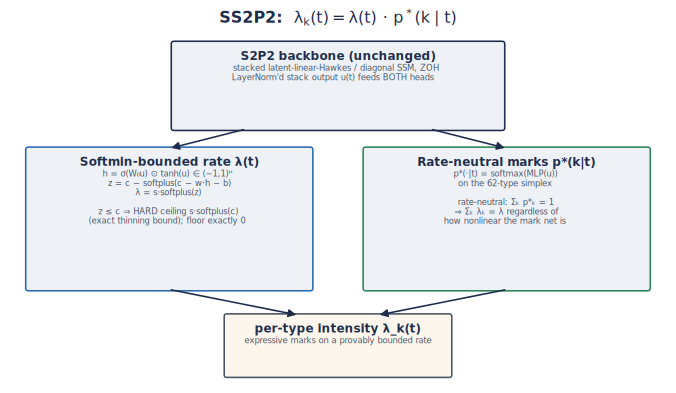
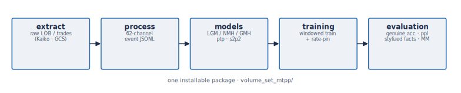

# LGM: A Calibrated, Certifiable Factorized Neural Hawkes Process for Limit-Order-Book Simulation

This repository contains the artifacts for the paper *LGM: A Calibrated, Certifiable
Factorized Neural Hawkes Process for Limit-Order-Book Simulation* (preprint, in preparation).
LGM is a factorized neural marked temporal point process (MTPP) for limit-order-book (LOB)
event streams that is **calibrated, stable, certifiable, and a competitive predictor at the
same time** — the first model in our study to achieve all of these together.

## **Overview**

Neural MTPPs predict the next LOB event well but **simulate** it poorly: in free roll-out
they over-disperse or explode, and their stability cannot be honestly certified. We trace
this to (i) a train/simulate mismatch — windowed cold-start training mis-calibrates the
rate, so free roll-out runs away (20–40× over-firing) — and (ii) a gauge pathology — a
LayerNorm read-out makes the branching ratio scale-invariant, so it cannot be measured from
weights. **LGM** removes both by construction: it factors the per-type intensity into a
*linear* scalar ground rate and a *deep* soft-max mark head, `λ_k(t) = Λ(t)·p(k|t)`. Because
the soft-max lives on the probability simplex it is **rate-neutral**, so the total rate
`Σ_k λ_k = Λ` stays a pure linear Hawkes process no matter how nonlinear the mark net is —
the exact stationary mean survives and we **pin** it (`μ₀ = R(1−n) ⇒ Λ̄ = R`), with a
gauge-free branching ratio `n` as a closed-form stability certificate.

<p align="center">
  
</p>

The whole study is one installable package with a stage-by-stage pipeline — from raw-data
extraction through event construction, the model zoo, training, and the evaluation battery
(genuine-event accuracy, stylized facts, and a market-making world model).

<p align="center">
  
</p>

## **Repository Structure**
- `volume_set_mtpp/`: the core package — `extract/` (raw LOB/trade download), `process/`
  (event construction), `models/` (decoders **lgm**/nmh/gmh/ptp_s2p2/s2p2 + framework +
  `ARCHITECTURE.md`), `training/` (train + data loader), `evaluation/` (stylized facts,
  genuine eval, baselines, `market_making/`).
- `scripts/`: command-line entry points (`fetch_data.py`, `build_events.py`, `train.py`,
  `evaluate.py`) plus the SGE run scripts and the **automated HPC runner + email watcher**
  (`submit_run.sh`, `watch_runs.sh`, `notify_email.py`, `hpc-common.sh`).
- `diagram/`: figures used in the README and paper (regenerate with `make_diagrams.py`).
- `paper/`: LaTeX source-of-truth (`main.tex`) and the committed render (`main.pdf`).
- `docs/`: `RUNBOOK.md`, `ADDING_A_MODEL.md`, `RESULTS.md`, `ROADMAP.md`, `MODEL_NOTES.md`.
- `tests/`: `smoke_decoder.py` (interface-contract check); `results/`: numeric summaries.

## **Quick Start**

### 1. Set up the environment

- Clone the repository
```
git clone https://github.com/honglinfu98/simulation.git
cd simulation
```
- Give execute permission to the setup script and run it
```
chmod +x setup_repo.sh
./setup_repo.sh
. venv/bin/activate
```
- Configure environment variables: rename `.env.example` to `.env` and fill in your UCL HPC
  connection and (for the watcher) Gmail SMTP app password:
```
HPC_USER = "..."
HPC_RUN_HOME = "/home/<user>/volume-set-mtpp"
SMTP_USER = "..."
SMTP_PASS = "..."        # Gmail App Password
```

### 2. Build the dataset

Extraction runs on the UCL HPC cluster (needs Kaiko/GCS credentials; see
`volume_set_mtpp/extract/README.md`), then event construction:
```
python scripts/fetch_data.py orderbook --crypto eth --parallel 4
python scripts/fetch_data.py trades    --crypto eth --parallel 4
python scripts/build_events.py
```

### 3. Train a model
```
python scripts/train.py \
    --decoder-type lgm \
    --data-dir <events_dir> \
    --lgm-target-rate 2.381 --nmh-project-rho 0.86 \
    --mark-head categorical --epochs 40
```

### 4. Evaluate
```
python scripts/evaluate.py genuine --checkpoint <ckpt> --data-dir <events_dir>   # accuracy + perplexity
python scripts/evaluate.py facts   --checkpoint <ckpt> --data-dir <events_dir>   # stylized facts (free rollout)
python scripts/evaluate.py table                                                  # rebuild comparison table
```

### 5. (Optional) Automated HPC runs with email on completion

Submit to the cluster and walk away — the watcher emails you when each run finishes:
```
bash scripts/hpc-common.sh open        # seed the SSH ControlMaster (one password prompt)
bash scripts/submit_run.sh --tag lgm086 --decoder lgm \
    --extra "--decoder-type lgm --lgm-target-rate 2.381 --nmh-project-rho 0.86 --mark-head categorical"
set -a; source .env; set +a
bash scripts/watch_runs.sh             # emails: [sim] lgm086 DONE rho=.. genacc=.. Fano=..
```
See `docs/RUNBOOK.md` for the unattended (launchd) setup.

## **Results**

Gemini ETH-USD, 62 event types; real rate ≈ 2.38 ev/s.

| Model | GenAcc | Fano(1s) | branching ρ | free-roll rate | sim status |
|---|---|---|---|---|---|
| Compound Hawkes | 0.18 | 8.8 | 0.64 (exact) | ~2 | stable, no long-memory |
| s2p2 (best predictor) | **0.32** | 41 | gauge-broken | — | over-disperses |
| NMH / GMH (windowed neural) | 0.26 | explode | 1300 / 0.8 | 52–100/s | explode / Poisson |
| **LGM (n=0.86)** | **0.29** | **6.0** | **0.86 (honest)** | **2.22/s** | **calibrated ✓** |

LGM uniquely is calibrated (rate within ~7% of real) **and** a competitive predictor **and**
clustered (Fano) **and** carries a closed-form stability certificate; the branching ratio is
a single interpretable knob setting the Fano-vs-scale curve via `1/(1−ρ)²`. *Honest caveats
(see `docs/`):* return tails ~2× lighter than the robust empirical target; mildly
over-reflexive; raw 1 s kurtosis/skew are outlier-dominated (read winsorized / at ≥5 s buckets).

## **License**
This project is licensed under the MIT License — see the [LICENSE](LICENSE) file for details.

## **Citation**

```
@article{fu2026lgm,
  title  = {LGM: A Calibrated, Certifiable Factorized Neural Hawkes Process for Limit-Order-Book Simulation},
  author = {Fu, Honglin},
  year   = {2026},
  note   = {Preprint, in preparation}
}
```
